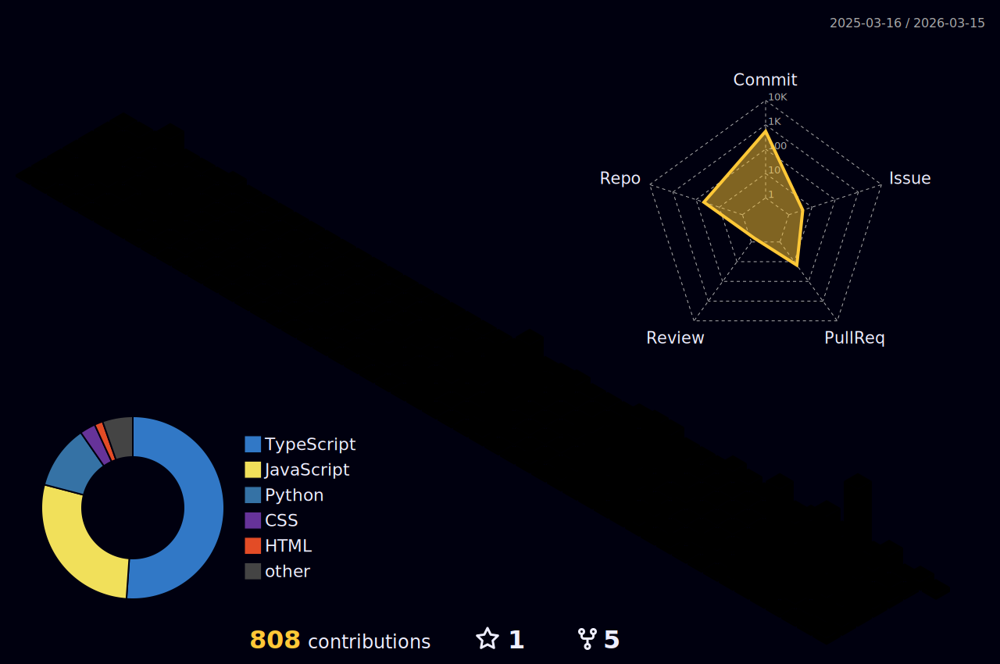

  

---

### 🛠️ Languages and Tools

  

---

### 📊 GitHub Stats

  
  

 

  

---

### 🐍 Contributions & Activity

<!-- 3D Contribution Graph -->

  

 

<!-- Snake Animation -->

  

---

### 🏆 Trophies

  <!--  -->

---

  
  ### 🤝 Let's Connect
  
  

    
    
  

  
   
  
  

